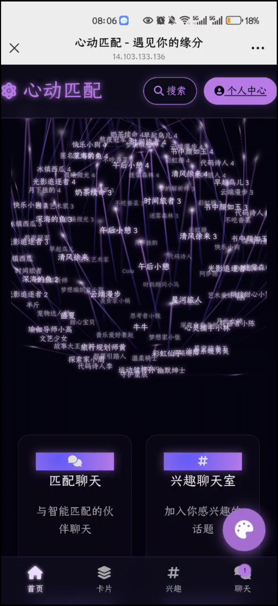
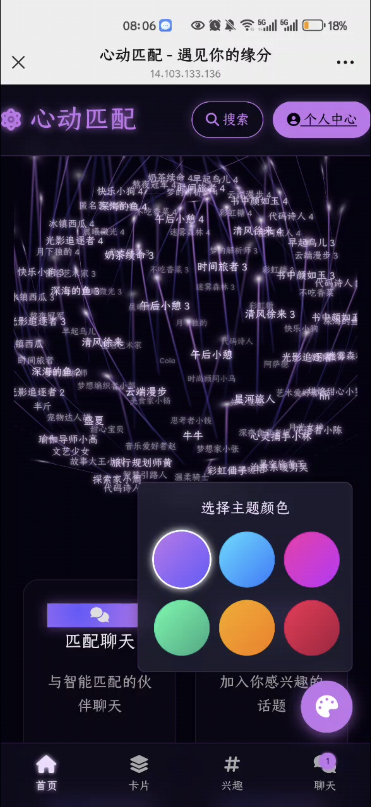
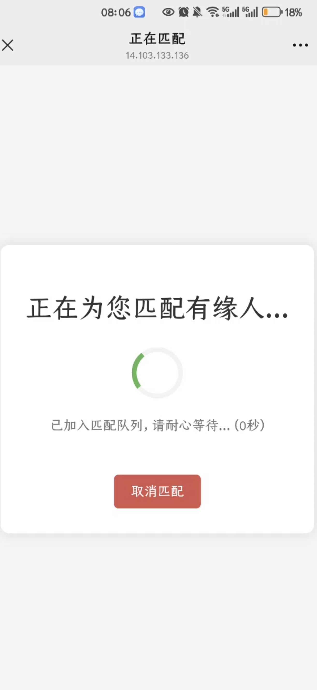
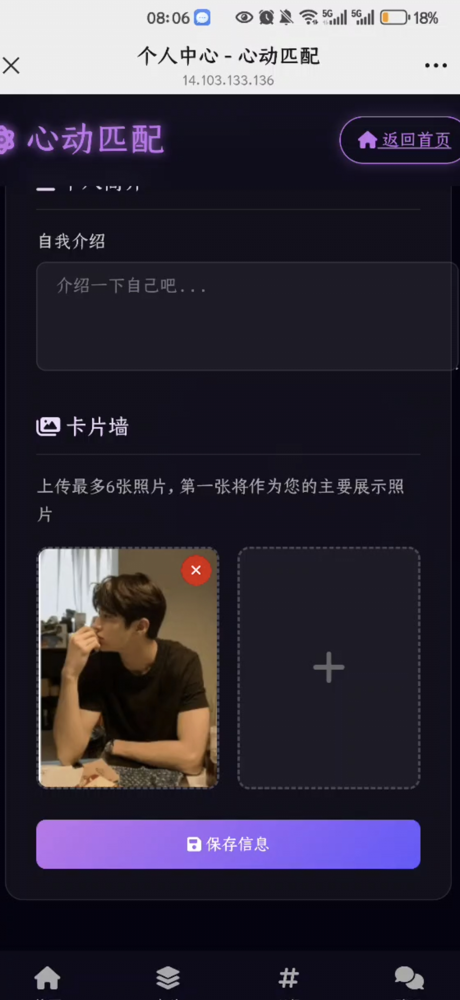
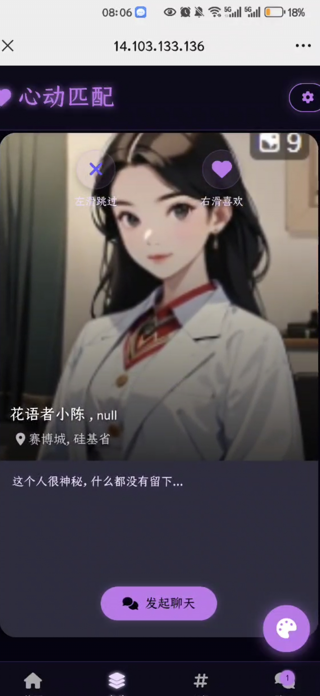
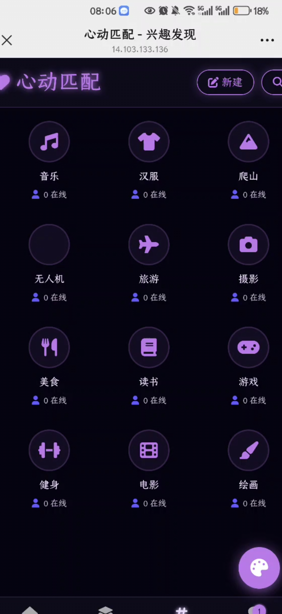
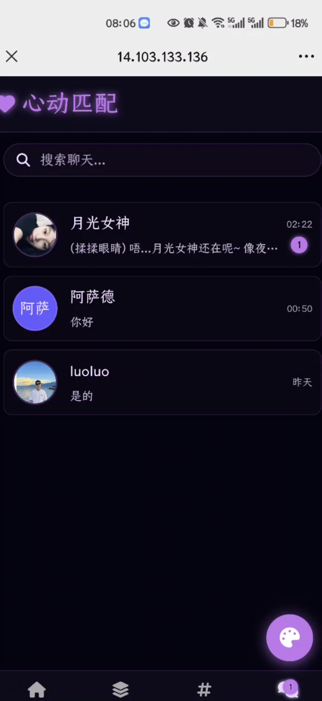
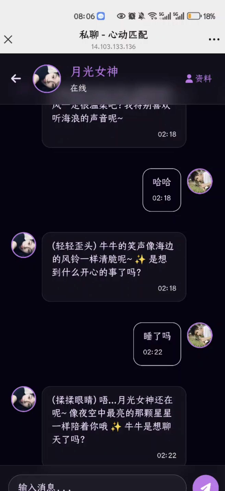

## gitee地址
https://gitee.com/fdfgasdvdxz/xiangqin


## 界面截图

|  |  |  |  |
|--------------------------------------------------------|--------------------------------------------------------|--------------------------------------------------------|--------------------------------------------------------|
|  |  |  |  |
# 心动匹配 - 前端界面

本项目是“心动匹配”应用的前端部分，为用户提供了完整的交互界面，包括注册、登录、个人资料展示、滑动匹配、实时聊天等。

## 技术栈

- **HTML5**: 页面结构
- **CSS3**: 页面样式和布局
- **JavaScript (ES6+)**: 页面交互逻辑、API请求和WebSocket通信

本项目未使用任何前端框架，完全由原生HTML、CSS和JavaScript构建，以保持轻量和简单。

## 目录结构

```
.
├── frontend/
│   ├── index.html           # 应用主入口/登录页
│   ├── register.html        # 注册页
│   ├── swipe.html           # 滑动匹配页
│   ├── chat-list.html       # 聊天列表页
│   ├── chat-room.html       # 聊天室/私聊页
│   ├── profile.html         # 个人资料页
│   ├── css/
│   │   └── styles.css       # 主要样式文件
│   ├── js/
│   │   ├── config.js        # 前端配置文件（API和WebSocket地址）
│   │   └── ...              # 各页面的JavaScript逻辑
│   └── assets/              # 存放图片等静态资源
└── server.py                # 一个简单的Python HTTP服务器，用于本地开发
```

## 如何运行

1.  **配置后端地址**

    在 `frontend/js/config.js` 文件中，确保API服务器和WebSocket服务器的地址正确指向你正在运行的后端服务。

    ```javascript
    // frontend/js/config.js
    const API_BASE_URL = 'http://localhost:5000'; // 修改为你的后端API地址
    const WEBSOCKET_URL = 'ws://localhost:8766'; // 修改为你的后端WebSocket地址
    ```

2.  **启动本地服务器**

    为了避免浏览器的CORS（跨域资源共享）策略限制，你需要通过一个本地HTTP服务器来访问这些HTML文件，而不是直接在文件系统（`file://...`）中打开。

    项目根目录提供了一个简单的Python服务器 `server.py`。你可以运行它来启动一个本地开发服务器：

    ```bash
    python server.py
    ```
    这将在默认端口（通常是8000）上启动一个服务器。

3.  **访问应用**

    在浏览器中打开以下地址即可开始使用：
    [http://localhost:8000/frontend/](http://localhost:8000/frontend/)

    你将被引导至登录页面 (`index.html`)。

## 功能页面

- **登录/注册**: 用户认证流程。
- **滑动匹配 (`swipe.html`)**: 核心的卡片滑动匹配功能。
- **匹配大厅 (`matching_lobby.html`)**: 等待系统匹配的界面。
- **聊天列表 (`chat-list.html`)**: 显示所有进行中的对话。
- **聊天室 (`chat-room.html`)**: 与其他用户或机器人进行实时文字聊天。
- **个人资料 (`profile.html`)**: 查看和编辑个人信息。

# 心动匹配 - 后端服务

本项目是“心动匹配”应用的后端部分，提供了用户认证、数据管理、实时聊天和智能匹配等核心功能。

## 技术栈

- **Python 3**: 主要编程语言
- **Flask**: 轻量级Web框架，用于提供HTTP API接口
- **WebSockets**: 用于实现实时双向通信（聊天、匹配通知）
- **SQLite**: 轻量级数据库，用于存储用户信息、聊天记录等
- **Apscheduler**: 用于执行定时任务（例如机器人定时问候）
- **DeepSeek API**: 用于驱动机器人聊天功能

## 目录结构

```
.
├── backend/
│   ├── http_server.py       # Flask HTTP服务器，处理API请求
│   ├── websocket_server.py  # WebSocket服务器，处理实时消息
│   ├── config.py            # 统一的配置文件
│   ├── users.db             # SQLite数据库文件
│   └── ...
├── scripts/
│   └── ...                  # 各种数据处理和初始化脚本
├── requirements.txt         # Python依赖包列表
└── start_servers.py         # 主启动脚本
```

## 安装与启动

1.  **安装依赖**

    请确保你已安装 Python 3。然后通过 pip 安装所有必需的库：
    ```bash
    pip install -r requirements.txt
    ```

2.  **配置服务**

    所有关键配置项都位于 `backend/config.py` 文件中。你可以根据需要修改以下内容：
    - `DATABASE_PATH`: 数据库文件的路径
    - `HTTP_HOST` / `HTTP_PORT`: API服务的监听地址和端口
    - `WEBSOCKET_HOST` / `WEBSOCKET_PORT`: WebSocket服务的监听地址和端口
    - `DEEPSEEK_API_KEY`: DeepSeek AI的API密钥

3.  **启动服务**

    运行主启动脚本来同时启动HTTP和WebSocket服务器：
    ```bash
    python start_servers.py
    ```
    服务器成功启动后，你将看到API服务和WebSocket服务的地址。

## 功能概览

- **用户系统**: 注册、登录、个人资料管理。
- **匹配系统**:
    - 基于地理位置和性别的实时匹配。
    - 超时后自动匹配AI机器人。
- **聊天系统**:
    - 支持一对一私聊。
    - 支持与AI机器人聊天。
    - 实时打字状态提示。
- **机器人系统**:
    - AI机器人可以模拟真实用户进行对话。
    - 定时任务，让机器人主动向真实用户发送问候。
